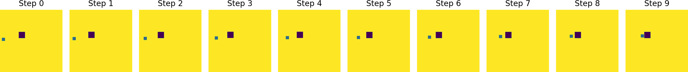
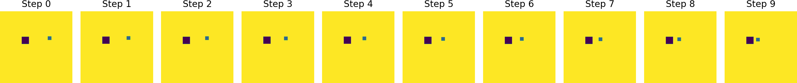
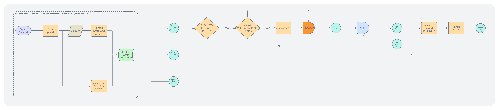

**Note**: I took the core codebase for environment simulation and related infrastructure in this repository from my assignments in the Deep Decision Making and Reinforcement Learning (DDRL) course at New York University. I only implemented the Behavior Cloning, Goal-Conditioned Behavior Cloning, DAgger, Double Q-Learning, Dueling DQN, and PPO algorithms. Their performance are shown in the GIFs below. 

## Environment 

  

## Expert Dataset 

### Changing Goal 

**Episode 1**

**Episode 2**

**Episode 3**

### Fixed Goal 

**Episode 1**

**Episode 2**

**Episode 3**

### Multimodal

**Episode 1**

**Episode 2**

**Episode 3**

## Behavior Cloning

  

    

      <h4>Fixed Goal</h4>
      
    

    

      <h4>Changing Goal</h4>
      
    

    

      <h4>Multimodal</h4>
      
    

  

In the fixed goal dataset, the same observation always maps to the same action and MLP can learn this mapping easily because there is no conflicting signal. That's why it performs well on fixed goal dataset. 

In the changing goal dataset, the same observation can map to different actions in different episodes. That's why MLP fails to learn this mapping and performs poorly on changing goal dataset.

In the multimodal dataset, the goal is fixed but there are different paths to reach the goal. Therefore, like in changing goal dataset, the same observation can map to different actions in different episodes. That's why MLP fails to learn this mapping and performs poorly on multimodal dataset as well.

## Goal Conditioned Behavior Cloning

  

    

      <h4>Fixed Goal</h4>
      
    

    

      <h4>Changing Goal</h4>
      
    

    

      <h4>Multimodal</h4>
      
    

  

In the goal conditioned behavior cloning, we use observation and goal as input to the MLP and try to learn the mapping from observation and goal to action. This way, the MLP can learn the mapping from observation to action in a goal-conditioned manner. 

In the fixed dataset, the model still performs well because of the same reasons as in behavior cloning. 

In the changing dataset, the model performs well because when the observation is the same and the action is different in different episodes, the goal is different as well and this makes the input to the model unique. Therefore, MLP can learn the mapping from observation and goal to action in a goal-conditioned manner.

But in the multimodal setting, the expert has multiple valid paths to the **same goal**. So, the model can see [x, y, $g_x$, $g_y$] with action "go left" in some episodes and [x, y, $g_x$, $g_y$] with action "go right" in other episodes even though the goal is the same. The model is back to the same problem as behavior cloning: the loss averages the conflicting actions, and µ lands somewhere between the two valid directions.

## Behavior Transformer

  

    

      <h4>Fixed Goal</h4>
      
    

    

      <h4>Changing Goal</h4>
      
    

    

      <h4>Multimodal</h4>
      
    

  

