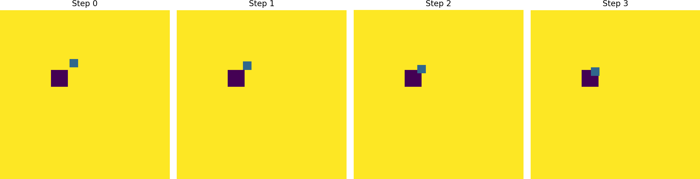

**Note**: I took the core codebase for environment simulation and related infrastructure in this repository from my assignments in the Deep Decision Making and Reinforcement Learning (DDRL) course at New York University. I only implemented the Behavior Cloning, Goal-Conditioned Behavior Cloning, DAgger, Double Q-Learning, Dueling DQN, and PPO algorithms. Their performance are shown in the GIFs below.

## Environment 

## Expert Dataset 

### Changing Goal 

### Fixed Goal 

### Multimodal

## Replay Buffer

## Behavior Cloning 

  

    

      <h4>Changing Goal</h4>
      
    

    

      <h4>Fixed Goal</h4>
      
    

    

      <h4>Multimodal</h4>
      
    

  

## Goal Conditioned Behavior Cloning

  

    

      <h4>Changing Goal</h4>
      
    

    

      <h4>Fixed Goal</h4>
      
    

  

## Behavior Transformer 

## Dagger

## Q-Learning

## Double Q-Learning 

## Dueling DQN 

## Reinforce 

## PPO 

