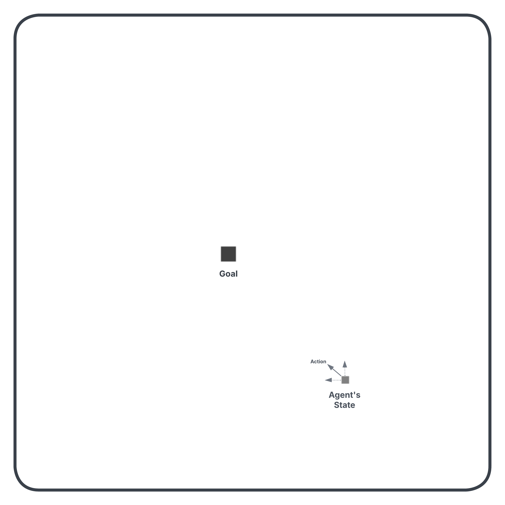
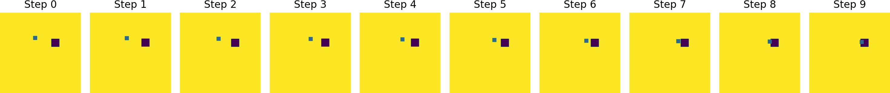
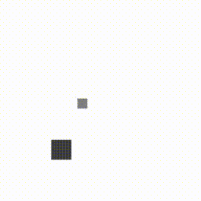

## Environment 

  

## Expert Dataset 

### Changing Goal 

**Episode 1**

**Episode 2**

**Episode 3**

### Fixed Goal 

**Episode 1**

**Episode 2**

**Episode 3**

### Multimodal

**Episode 1**

**Episode 2**

**Episode 3**

## Behavior Cloning

  

    

      <h4>Fixed Goal</h4>
      
      
In the fixed goal dataset, the same observation always maps to the same action and the MLP can learn this mapping easily because there is no conflicting signal. That's why it performs well on the fixed goal dataset.

    

    

      <h4>Changing Goal</h4>
      
      
In the changing goal dataset, the same observation can map to different actions in different episodes. That's why the MLP fails to learn this mapping and performs poorly on the changing goal dataset.

    

    

      <h4>Multimodal</h4>
      
      
In the multimodal dataset, the last goal is fixed but the agent should reach other goals first before reaching the last goal. Therefore, like in the changing goal dataset, the same observation can map to different actions (because of different intermediate goals) in different episodes. That's why the MLP fails to learn this mapping and performs poorly on the multimodal dataset.

    

  

## Goal Conditioned Behavior Cloning

  

    

      <h4>Fixed Goal</h4>
      
      
In the fixed goal dataset, the model still performs well for the same reasons as in behavior cloning.

    

    

      <h4>Changing Goal</h4>
      
      
In the changing goal dataset, the model performs well because when the observation is the same and the action is different in different episodes, the goal is different as well and this makes the input to the model unique. Therefore, the MLP can learn the mapping from observation and goal to action in a goal-conditioned manner.

    

    

      <h4>Multimodal</h4>
      
      
In the multimodal setting, even though intermediate goals can be different in different episodes, since we are feeding the next goal as input to the model at each step, the model performs well on this dataset as well.

    

  

## Behavior Transformer

  

    

      <h4>Fixed Goal</h4>
      
      
In the fixed goal dataset, since the goal is the same across all episodes, for any given observation [x, y], there's only one correct action direction which is toward that fixed goal. This means that the expert actions for the same observation always belong to the same cluster. The ground truth label is always cluster i and it never conflicts with cluster j. The binning head learns this consistent mapping easily, argmax picks the right cluster every time, the offset refines it to the precise action, and the agent learns to reach the goal easily.

    

    

      <h4>Changing Goal</h4>
      
      
In the changing goal setting, we see that the model performs very poorly because of similar reasons as in behavior cloning. Let's say the agent is at [x, y] position in episode a and episode b of the changing goal setting. Since the goals will be different, the expert actions will be different as well and therefore they will be associated with different clusters. Let's call them cluster i and cluster j. In other words, the ground truth label for the same observation might be either cluster i or cluster j. Let's say that cluster i represents "go toward top left", cluster j represents "go toward right". When the agent is at [x, y], and argmax picks cluster j that puts the agent in the wrong direction, the agent will never reach the target. And this is what we see in the gif above.

    

    

      <h4>Multimodal</h4>
      
      
The same things can be said in the multimodal setting as well. In the multimodal setting, there are intermediate goals that change in different episodes and one final goal that is the same in each episode. Similar to the changing goal setting, the agent picks a cluster with argmax and that cluster can sometimes put the agent in the wrong direction and cause it to miss the intermediate goals. In the gif above, we see that the agent always follows the same path regardless of the positions of the intermediate goal, which is correct for some episodes and wrong for others. The problem here is at inference. The model needs to pick the right cluster for the current episode but it doesn't have that information (the intermediate goal) to make that choice. And since the final goal is always fixed, the agent is still able to reach the final goal even when it misses the right intermediate goals because every cluster that was learned from the expert data ultimately leads the agent to the final goal.

    

  

## References

- Nur Muhammad Mahi Shafiullah, Zichen Jeff Cui, Ariuntuya Altanzaya, Lerrel Pinto. "Behavior Transformers: Cloning *k* modes with one stone." *Thirty-Sixth Conference on Neural Information Processing Systems*, 2022. [[Paper]](https://openreview.net/forum?id=agTr-vRQsa)
